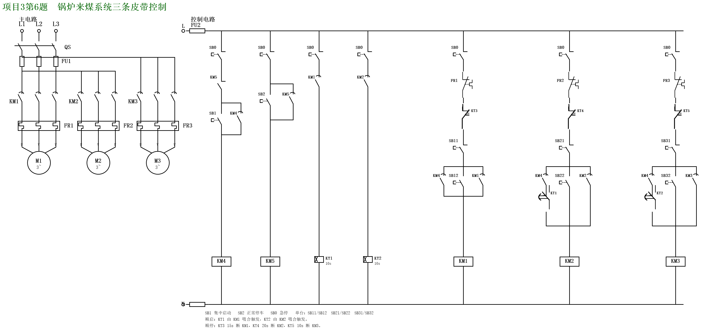

# 机电控制实习

这个仓库整理的是机电控制实习中两道指定题目的最终成品、备料清单和出图脚本。当前完成的内容对应任务书里的项目2第1题和项目3第6题，最终交付物已经收敛到两张成品图，不再混放早期试稿、压缩版和调试残图。

仓库里最值得先看的，是 [成图输出/项目2-1_成品.png](成图输出/项目2-1_成品.png) 和 [成图输出/项目3-6_成品.png](成图输出/项目3-6_成品.png)。前者是“两台电机顺序启动控制”，后者是“锅炉来煤系统三条皮带控制”。如果需要按图备料，可以直接看 [实验材料清单.md](实验材料清单.md)；如果后面还要继续返工、重画或者复用这套方法，核心文件是 [脚本/重画电路图.ps1](脚本/重画电路图.ps1)。

`课程资料` 文件夹保留了题目来源，也就是任务书和上课用的 PPT；`元件图` 文件夹保留了本次出图时参考和提取过的元件素材。整个仓库的思路不是只保存一张最终图片，而是把“题目来源、符号依据、最终成品、可重复生成脚本”放在同一个地方，保证后面继续改图时还能追溯。

如果第一次打开这个仓库，最省事的顺序是先看两张成品图，再看材料清单，最后再看技术日志和出图脚本。这样先理解交付结果，再理解备料，再理解我是怎么一步步把图收敛成现在这个样子的。

## 当前目录说明

- `成图输出`：最终保留的两张成品图。
- `实验材料清单.md`：两道题对应的材料清单，按“名称 x 数量；”整理。
- `脚本`：自动生成和重画电路图所用脚本。
- `技术日志.md`：这次任务中真正有复用价值的经验记录。
- `课程资料`：任务书与课堂 PPT。
- `元件图`：课程符号参考图和裁切后素材。

## 成品预览

### 项目2第1题

### 项目3第6题

