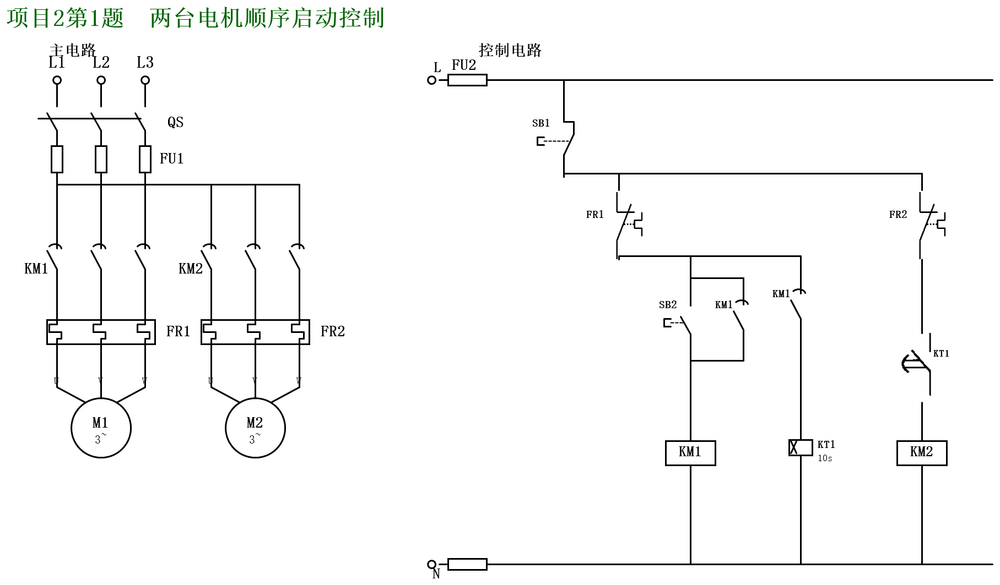
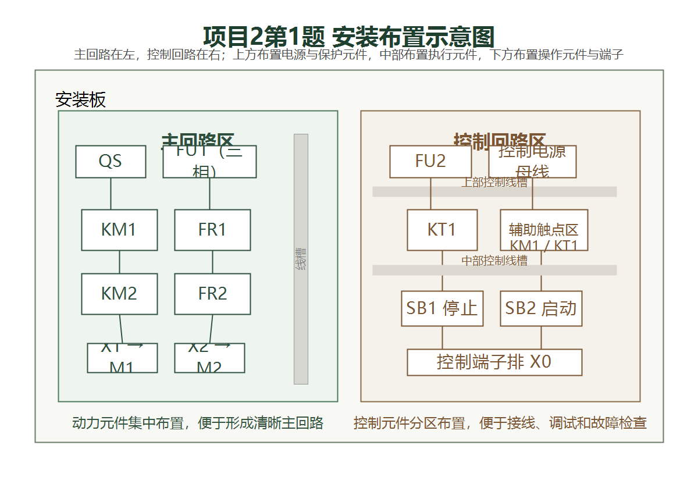

# 电气控制实习课程实习报告

## 项目2第1题 两台电机顺序启动控制

姓名：__________    学号：__________    班级：__________

指导教师：张惠莉、李新成    实习地点：工程楼 506

### 一、设计题目与设计要求

本次课程实习选做的内容为顺序控制项目中的项目2第1题，题目名称为“两台电机顺序启动控制”。任务书给出的核心要求是：电动机 `M1` 先启动，经过 `10 s` 延时后电动机 `M2` 自动启动，同时整套线路应具备短路保护和过载保护功能。结合实验台实际接线与操作需要，设计时还应保证控制回路具有统一启动、统一停车和运行保持能力，使电路动作清晰、运行可靠、便于安装调试。

本题虽然控制目标不复杂，但很适合用来训练继电接触控制线路的基本设计方法。通过完成本题，可以进一步熟悉主电路与控制电路分离的画法，理解接触器自锁、时间继电器延时以及热继电器过载保护在典型电气控制系统中的作用，并为后续更复杂的顺序控制题打下基础。

### 二、设计原理及原理电路图

本设计采用典型的继电接触控制方案，由主电路和控制电路两部分组成。主电路中，三相电源经总开关 `QS` 和主回路熔断器 `FU1` 后，分别送入两条动力支路。第一条支路通过交流接触器 `KM1` 的主触点和热继电器 `FR1` 接至电动机 `M1`；第二条支路通过交流接触器 `KM2` 的主触点和热继电器 `FR2` 接至电动机 `M2`。这样布置以后，两台电动机各有独立的主回路通断元件和过载保护元件，既满足功能要求，也便于后续接线和故障检查。

控制电路由控制回路熔断器 `FU2` 单独供电保护。停止按钮 `SB1` 采用常闭触点，串联在控制总回路前端，起到统一停车和事故切断的作用；启动按钮 `SB2` 采用常开触点，用于发出起动指令。按下 `SB2` 后，交流接触器 `KM1` 线圈首先得电吸合，其主触点闭合，电动机 `M1` 启动运行，同时 `KM1` 的辅助常开触点闭合形成自锁，保证松开启动按钮后 `KM1` 仍能继续保持吸合状态。与此同时，另一只由 `KM1` 吸合触发的辅助常开触点接通时间继电器 `KT1` 线圈，`KT1` 开始计时。

当 `KT1` 通电延时达到 `10 s` 后，其延时常开触点闭合，使交流接触器 `KM2` 线圈得电吸合，第二台电动机 `M2` 自动投入运行，从而实现“`M1` 先启动、`10 s` 后 `M2` 再启动”的顺序控制要求。保护环节方面，主回路中的 `FU1` 用于短路保护，控制回路中的 `FU2` 用于控制支路短路保护，热继电器 `FR1`、`FR2` 则分别承担两台电动机的过载保护任务。这样，电路既能完成题目要求的顺序起动，又兼顾了运行安全性和回路独立性。

下图为本题完成后的原理电路图。图中左侧为主电路，右侧为控制电路，符合课程实习对标准电气原理图的绘制要求。

### 三、元器件及材料选择

本题共需三相异步电动机 `2` 台，分别记为 `M1` 和 `M2`；交流接触器 `2` 只，分别为 `KM1` 和 `KM2`；三相热继电器 `2` 只，分别为 `FR1` 和 `FR2`；通电延时型时间继电器 `1` 只，记为 `KT1`；停止按钮 `1` 只，记为 `SB1`；启动按钮 `1` 只，记为 `SB2`；总开关 `1` 只，记为 `QS`；主回路熔断器 `3` 只，统一记为 `FU1`；控制回路熔断器 `1` 只，记为 `FU2`。除上述主要电器元件外，安装时还需要接线端子、导线、号码管、安装板及紧固件等辅助材料。

器件选择的依据主要来自题目功能需求和实验台的常用配置。两台交流接触器分别承担两台电动机的主回路控制与辅助触点控制任务，是顺序启动逻辑的核心执行元件；时间继电器 `KT1` 负责提供精确的 `10 s` 延时，是实现前后级顺序动作的关键元件；热继电器用于长期过载保护，能够在电动机过载发热时切断控制支路，避免电机长期超载运行。熔断器的设置遵循“主回路与控制回路分开保护”的原则，其中 `FU1` 负责动力支路短路保护，`FU2` 负责控制支路短路保护，这样既符合标准电气设计思路，也便于故障定位。

在参数整定上，时间继电器 `KT1` 的延时时间直接按题目要求整定为 `10 s`。热继电器的整定电流需要依据电动机额定电流进行选择，工程上通常以电动机铭牌额定电流为基准进行整定，实习接线时应结合实验台实际电机参数进行复核。熔断器的电流等级则按主回路和控制回路的电流等级分别选取，既保证故障时能够及时切断，又避免正常运行时误熔断。

### 四、设计电路的安装布置图

为了使布线简洁、层次清楚并便于检查，本题安装布置采用“主回路在左、控制回路在右，上方为电源与保护元件、中部为执行与控制元件、下方为按钮与端子”的布局思路。这样的分区方式可以缩短主回路走线长度，避免控制导线与动力导线交叉过多，同时也方便在调试时快速区分不同回路的功能。

下图给出了适合本题的安装布置示意图。图中并未展开每一根导线，而是重点表达器件在安装板上的相对位置关系和接线分区逻辑，便于后续按照原理图完成实物搭接。

从布置方式看，`QS`、`FU1`、`KM1`、`FR1`、`KM2`、`FR2` 等主回路元件集中布置在安装板左侧，便于形成清晰的动力通道；`FU2`、`KT1`、控制端子排以及线圈控制元件布置在右侧，使控制回路的引线更短、更规整；`SB1` 与 `SB2` 设置在下方易操作位置，符合实验台人工操作的习惯。这样的布局兼顾了阅读性、布线便利性和后续故障排查效率。

### 五、电气控制线路安装、调试及实验结果的记录分析

安装时应遵循先主回路、后控制回路，先固定元件、后编号接线的顺序。具体操作中，先将总开关、熔断器、接触器、热继电器和时间继电器按布置图固定在安装板上，再完成三相主回路的连接，最后完成控制回路接线。接线过程中应统一导线颜色和号码标识，保证主回路与控制回路分区明确，导线走向整齐，接点压接可靠，避免出现公共器件在多条支路中重复散画、实际接线却无法对应的情况。

调试前应先进行断电检查，重点核对以下内容：主回路与控制回路是否与原理图一致，停止按钮 `SB1` 是否为常闭状态，启动按钮 `SB2` 是否为常开状态，时间继电器 `KT1` 的整定值是否设置为 `10 s`，热继电器常闭保护触点是否正确串入相应控制支路，各接触器线圈与辅助触点编号是否对应无误。确认无误后方可送电。

按设计逻辑通电验证时，合上 `QS` 后，按下启动按钮 `SB2`，首先应观察到 `KM1` 吸合，电动机 `M1` 立即启动运行，同时 `KT1` 开始计时；延时约 `10 s` 后，`KT1` 的延时常开触点闭合，`KM2` 吸合，电动机 `M2` 自动启动运行，顺序启动要求得到满足。按下停止按钮 `SB1` 后，由于控制总回路被切断，两台电动机均应停止运行。对保护逻辑进行检查时，应确认熔断器能够提供短路保护，热继电器动作后能切断相应控制回路，从而实现过载保护。

从结果分析来看，本题控制逻辑较为清晰，关键在于把“谁负责启动”和“谁负责延时触发”区分明确。`KM1` 的作用不仅是接通第一台电机主回路，还承担了触发 `KT1` 计时的功能；`KT1` 的作用则是延时发出第二台电机的启动条件，而不是直接代替接触器完成主回路通断。正因为控制责任分工清楚，整个电路动作链条短、逻辑明确，既满足题目功能要求，也方便后续调试与维护。

### 六、设计心得体会

通过完成本题，我对继电接触控制线路中“顺序启动”的实现方法有了更具体的认识。以前容易把顺序动作简单理解为“前一个元件动作后带动后一个元件动作”，这次在实际设计中更清楚地看到，真正稳定可靠的实现方式是把接触器自锁、时间继电器延时和保护回路串联关系同时考虑进去。只有把主电路、控制电路和保护回路的职责划分清楚，电路的动作过程才不会混乱。

本题还让我进一步体会到标准电气原理图的重要性。课程实习中的“画电路图”并不是简单把控制逻辑说明白，而是要按照规范把主电路、控制电路、触点、线圈和保护环节准确表达出来。采用规范图符和清晰排布后，不仅老师更容易检查，自己在接线和调试时也能明显减少返工。

另外，在写实验报告的过程中也能感觉到，报告并不是把原理图再抄一遍，而是要把设计要求、控制思路、器件选择、安装方法和调试结果串成一条完整的逻辑链。只有把“为什么这样设计、它是怎么工作的、安装时应怎样落地、最终现象是否符合预期”这些问题写清楚，实验报告才算真正完整。
